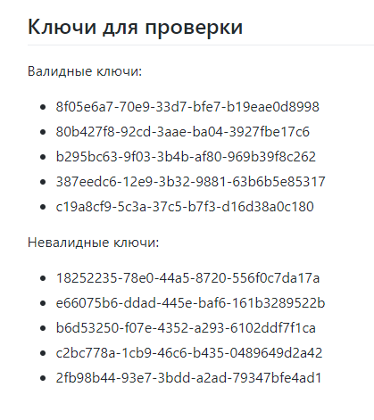
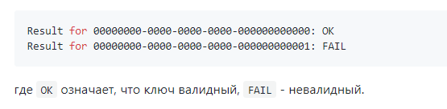

# Отчёт о проведённом тестировании
## Задачи
1. Протестировать документацию: *Инструкция по установке OpenJDK11 под Windows х64*
1. Протестировать установку программы OpenJDK11
1. Проверить запуск программы
1. Проверить совместимость OpenJDK11 с Java 11
1. Проверить, что приложение работает в соответствии с Инструкцией
## Шаги

1. Установить программу OpenJDK11 в соответствии с инструкцией:
    * Ознакомиться с инструкцией по установке OpenJDK11 по [ссылке](https://github.com/netology-code/javaqa-homeworks/blob/master/intro/openjdk11-manual.md)
    * Выполнить все действия, описанные в инструкции
    * Оценить понятность инструкции с точки зрения пользователя
    * Проверить полноту описываемых шагов, соответствие приложенных скриншотов фактическим окнам, которые появляются при установке 
    * Проверить установку с использованием командной строки Windows
1. Протестировать работу приложения в соответствии с Руководством использования KeyValidator
    * Ознакомиться с руководством использования KeyValidator, расположенного по [ссылке](https://github.com/netology-code/javaqa-homeworks/blob/master/intro/user-manual.md)
    * Скачать файл [KeyValidator.class](https://github.com/netology-code/javaqa-homeworks/blob/master/intro/artifacts/KeyValidator.class) на компьютер 
    
    * Открыть MINGW64 в папке, где хранится файл KeyValidator.class
    * Запустить команду:
    
    Проверить исполнение программы, подставляя значения ключей вместо нулей в соответствии с инструкцией:
    
    * Проверить исполнение валидных и невалидных ключей, сопоставить с ожидаемым результатом 
    
1. Описать обнаруженные ошибки (отклонения от ожидаемого результата) в соответствии с правилами оформления баг-репорта
## Выводы
 В результате тестирования документации были выявлены неточности. Результаты оформлены в виде баг-репорта в Issues.
 После установки приложения OpenJDK11 необходимо выполнить перезагрузку компьютера для корректной работы. 
 В результате проверки валидности ключей с использованием файла KeyValidator.class, предназначенного для работы на платформе Java 8+, выявлены несоответствия фактического и ожидаемого результата валидности ключей. Замечания оформлены в виде баг-репорта в Issues.
